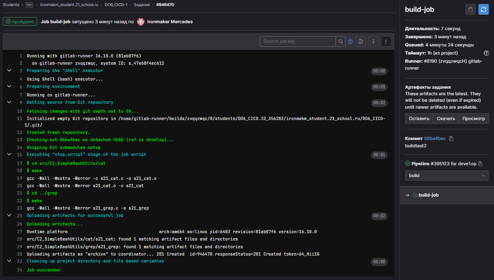

## Part 1. Настройка gitlab-runner  

1) устанавливаем gitlab-runner  

2) зарегистрируем  

 

## Part 2. Сборка  

1) Напишем .yml файл для описания стадии сборки приложения C2  

2) На гит-лабе в CI/CD посмотрим что сборка прошла успешна  

## Part 3. Тест кодстайла
1) Дополним файл .yml тестом на код стайл  

2) В случае успеха  

3) В случае фейла  

## Part 4. Интеграционные тесты  

1) Дополним файл .yml для запуска тестов  

2) Этапы проходят успешно  

## Part 5. Этап деплоя

1) Заходим на первой машине под пользователя gitlab-runner(sudo su gitlab-runner), создаём ключ и копируем его на вторую машину(ssh-copy-id deploy@192.168.0.12)  
  

2) Спустя миллион попыток, деплоем наши утилиты на вторую машину  
  
  
  